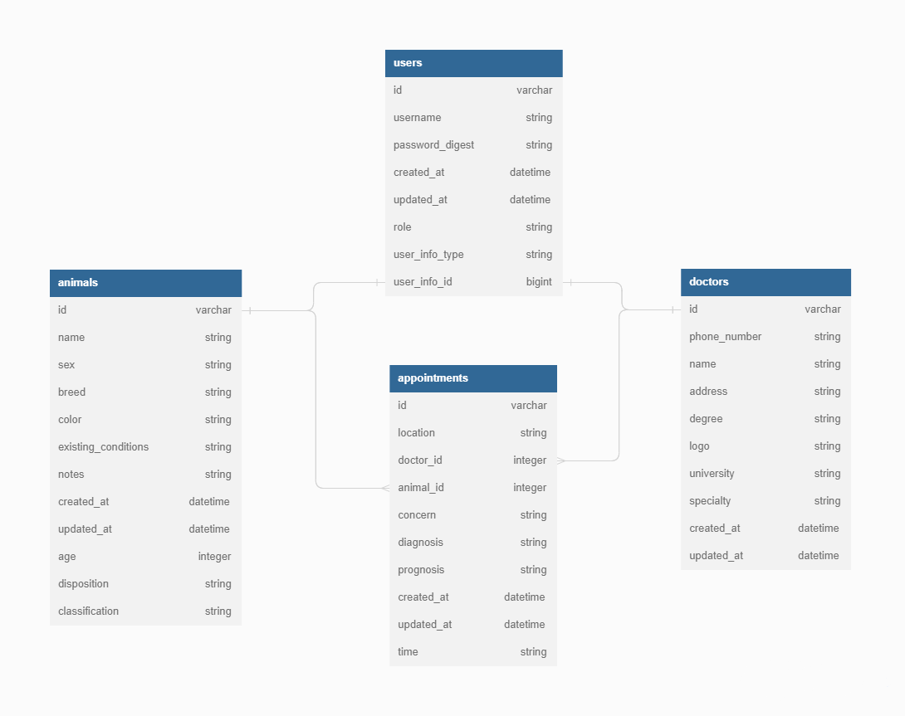
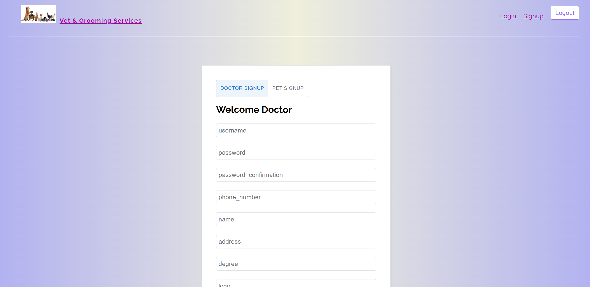
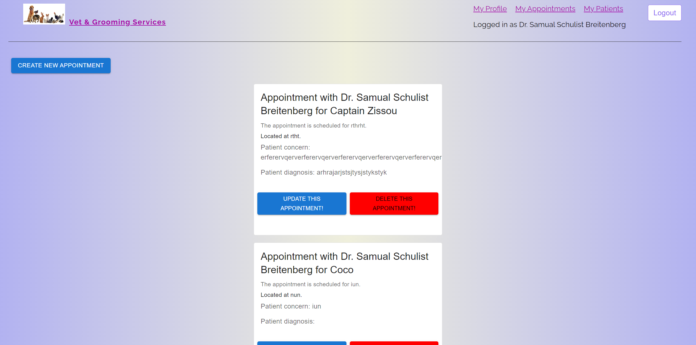
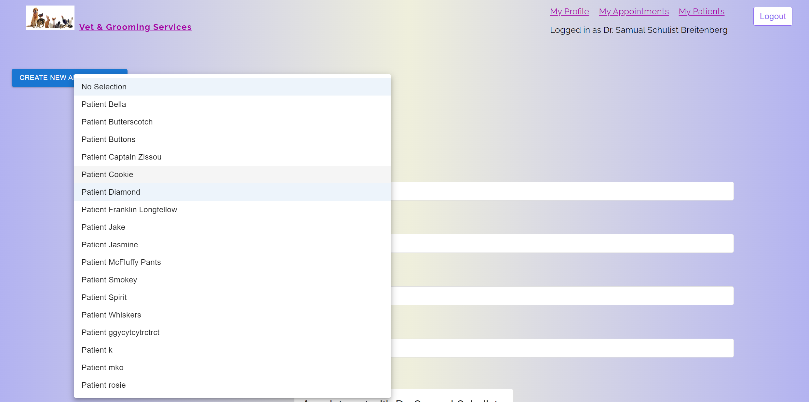

# Veterinary application

This is a single-page application that allows a doctor or a patient to login. The doctor can create, update and delete appointments, view their patients that have appointments and view other doctors in the clinic. The pet can also login and view their appointments, they can also update and delete their appointments. The app features auto-login and seamless handling of all types of users from the same forms.
  
## Table of Contents


- [Features](#Features)

- [Installation](#installation)

- [Usage](#usage)

- [Instructional-GIF](#Instructional-GIF)

- [Video-Describing-Functionality](#Video-Describing-Functionality)

- [License](#License)

- [Badges](#Badges)

  

## Features


1. The signup form can handle two types of users, a doctor or animal. The user is then automatically logged in, the user can log out then log in again. The usernames are unique so there is no need to choose the type of role being logged into. The user can automatically stay logged as long as the browser stays open.

2. The appointments page allows a doctor to create, read, update and delete appointments that are made with them. The animal logged in can also view, update and delete the appointments.

3. The doctor can view the patients with which appointments are made and sort and search through them. 

4. The doctor or animal logged in can view their own profile and view other like users at the clinic.

## Installation

This SPA requires both a front and back end and for that reason, there are a few installation commands that need to be used to set the application up for use.

First, clone the repository and once open in the editor, navigate to the client directory and run the command for installing the nodes using the following.
```js
$ npm install
```
It is built with the React framework and must be initialized by running the following command.
```js
$ npm start
```
The best method for setting up the back end requires opening a new terminal and preparing the backend first, by finding the ```vetapp``` directory and from within running the bundle installation.
```rb
$ bundle install
```
Then run the following to start the server.
```rb
rails s
```

Enjoy!

Clone the repo [from Github here](https://github.com/Bambam320/phase-4-vetapp-project)

  

## Usage

The SPA's functions are described below with imagery and code to best demonstrate their use.

***SPA Component Tree***

The component tree includes an index file that attaches the react app to the DOM. Then an ```<App>``` component provides context and routing for all children's elements. The first is a ```<NavBar>``` component that provides a logo and links which vary by the type of user logged in if logged in at all. The ```<LoggedIn>``` component provides the name of the currently logged in user. The next is the ```<Appointments>``` component which displays all appointments by using the ```<AppointmentCard>``` for each appointment. The ```<AppointmentCardUpdate>``` component provides a form that can be used by the doctor to update the appointment information. The ```<AppointmentForm>``` component provides a form which the doctor can use to create a new appointment. The ```<AllProfileCard>``` and ```<ProfileCard>``` components will render a ```<DoctorProfileCard>``` or ```<AnimalProfileCard>``` component based on what type of user is logged in. The next is the ```<Signup>``` component that offers a form for a user or a doctor to sign up. Last is the ```<Patients>``` component which shows the logged in doctors current patients.
```
Index from the src folder
└── App 
  ├── NavBar
  |   └── LoggedIn
  ├── Home
  ├── Login   
  ├── Appointments
  |   └── AppointmentCard
  |       └── AppointmentCardUpdate
  ├── AppointmentForm
  ├── AllProfileCard
  |   └── DoctorProfileCard
  |   └── AnimalProfileCard
  ├── Signup
  ├── Profile
  |   └── DoctorProfileCard
  |   └── AnimalProfileCard
  └── Patients
```
***Entity Relationship Model***

Each character in the schema has many spells and each spell belongs to a single character.



***SignUp Page***



The SignUp component renders provides a form that is provided by rendering a controlled input from each key in the object form. That data is sent to the back end and automatically used to create either a doctor or animal with an associated user.
```
  ├── Signup  
```

The ```<SignUp>``` component provides an object that is defaulted to either a form for doctors or animals to sign up. That form is controlled and submitted to the back end for creating a user and an associated doctor or animal. The create action below, determines if the parameters are meant for a doctor, then extract and permit only those that a doctor needs. Those params are used to create a new doctor which will then be used to create a new user by association. That user is returned with the appropriately provided information, where a doctor will be sent with the associated animals and vice versa.

```rb
  def create
    if params[:role] == 'doc'
    permitted_doctor_params = params.extract!(:phone_number, :name, :address, :degree, :logo, :university, :specialty).permit!
    doctor = Doctor.create!(permitted_doctor_params)
    permitted_user_params = params.extract!(
      :username, :password, :password_confirmation, :role
    ).permit!
    user = doctor.create_user!(permitted_user_params)
    session[:user_id] = user.id
    render json: user, include: ['user_info', 'user_info.appointments', 'user_info.animals'], status: 201
  elsif params[:role] == 'pet'
    permitted_animal_params = params.extract!(:name, :sex, :breed, :color, :existing_conditions, :age, :disposition, :classification).permit!
    animal = Animal.create!(permitted_animal_params)
    permitted_user_params = params.extract!(
      :username, :password, :password_confirmation, :role
    ).permit!
    user = animal.create_user!(permitted_user_params)
    session[:user_id] = user.id
    render json: user, include: ['user_info', 'user_info.appointments', 'user_info.doctors'], status: 201
    end
  end
```
***Appointments Pages***



The appointments pages provide functionality to render, create, update and delete appointments.

```
  ├── Appointments
  |   └── AppointmentCard
  |       └── AppointmentCardUpdate
```
The Appointments Controller is fairly straightforward It provides actions to view all, create, update or delete an appointment. 

```rb
# Appointments Controller
  #returns all appointments
  def index
    render json: Appointment.all, status: :ok
  end

  # creates an appointment and returns it if valid
  def create
    appointment = Appointment.create!(appointment_params)
    if appointment
      render json: appointment, status: :created
    end
  end

  # updates an appointment and returns it if valid
  def update
    if find_appointment.update!(appointment_params)
      render json: find_appointment, status: :ok
    end
  end

  #destroys the appointment provided and returns an empty object
  def destroy
    find_appointment.destroy
    render json: {}, status: :accepted
  end
```
The create, update, and destroy actions are protected from unauthorized users with the following private authorization methods.

```rb
  #authorizes a user for actions pertaining only to that user
  def authorize_user
    return render json: { errors: ["Not authorized"] }, status: :unauthorized unless session[:user_id] == find_appointment.doctor.user.id || session[:user_id] == find_appointment.animal.user.id
  end

  #authorizes a user to be logged in before allowing the action
  def authorize_general
    return render json:{errors: ["not authorized"]}, status: :unauthorized unless session.include? :user_id
  end
```


The animals index action provides all users when requested by an animal. If the request comes from a doctor, then the animals will be provided to the frontend with the animals that already have an association with the logged in doctor filtered out. 

```rb
  # sends only those animals that do not currently have an appointment with the logged in doctor
  def index
    user = User.find(session[:user_id])
    if user.user_info_type == 'Doctor'
      animals_with_set_appointments = Appointment.where('doctor_id = ?', user.user_info_id).map { |apps| apps.animal_id }
      animals_with_set_appointments.length > 0 ? nil : animals_with_set_appointments = [0]
      render json: Animal.where.not("id IN (?)", animals_with_set_appointments).order(:name), status: :ok
      # otherwise all animals are sent
    else
      render json: Animal.all, status: :ok
    end
  end

```
The associations are created in the model files as described below. The ```Appointments``` model uses a join table between ```Doctors``` and ```Animals``` where it holds the primary key of each model as its foreign key. The The doctor and animal each may have many appointments and the appointment belongs to a doctor and to an animal. The ```User``` model uses a has_one / belongs_to relationship with a doctor and an animal. The doctor and animal model each have a ```has_one :user, as: :user_info``` where each can hold a record in the ```users``` table stored as user_info. This is allowed through the polymorphic option set to true.
```rb
class Animal < ApplicationRecord
  # has a user names as user_info which is shared with the doctor model
  has_one :user, as: :user_info
  # has many appointments and doctors
  has_many :appointments
  has_many :doctors, through: :appointments
end

class User < ApplicationRecord
  #validates the username to be unique between animals and doctors
  validates :username, presence: true, uniqueness: true
  #has a secure password from bcrypt
  has_secure_password
  #belongs to the user_info index in user which can store animals or doctors using the polymorphic option
  belongs_to :user_info, polymorphic: true
end

class Doctor < ApplicationRecord
  # validates some attributes
  validates :name, :address, presence: true, uniqueness: true
  # has a user names as user_info which is shared with the doctor model
  has_one :user, as: :user_info
  #has many appointments and animals
  has_many :appointments
  has_many :animals, through: :appointments
end

class Appointment < ApplicationRecord
  #each appointment belongs to a doctor and an animal
  belongs_to :doctor
  belongs_to :animal
end
```

## Instructional-GIF

***Create a Character***


***Set a character as challenger or delete them***


## Video-Describing-Functionality

    
   [](https://youtu.be/rH4aGM5Rb3M)


## License

MIT License
Copyright (c) 2022 Igor M.  

Permission is hereby granted, free of charge, to any person obtaining a copy of this software and associated documentation files (the "Software"), to deal in the Software without restriction, including without limitation the rights to use, copy, modify, merge, publish, distribute, sublicense, and/or sell copies of the Software, and to permit persons to whom the Software is furnished to do so, subject to the following conditions:  

The above copyright notice and this permission notice (including the next paragraph) shall be included in all copies or substantial portions of the Software.

THE SOFTWARE IS PROVIDED "AS IS", WITHOUT WARRANTY OF ANY KIND, EXPRESS OR IMPLIED, INCLUDING BUT NOT LIMITED TO THE WARRANTIES OF MERCHANTABILITY, FITNESS FOR A PARTICULAR PURPOSE, E ,AND NON INFRINGEMENT. IN NO EVENT SHALL THE AUTHORS OR COPYRIGHT HOLDERS BE LIABLE FOR ANY CLAIM, DAMAGE, S OR OTHER LIABILITY, WHETHER IN AN ACTION OF CONTRACT, TOR  ,T OR OTHERWISE, ARISING FROM,
OUT OF OR IN CONNECTION WITH THE SOFTWARE OR THE USE OR OTHER DEALINGS IN THE SOFTWARE.

  

## Badges

  


